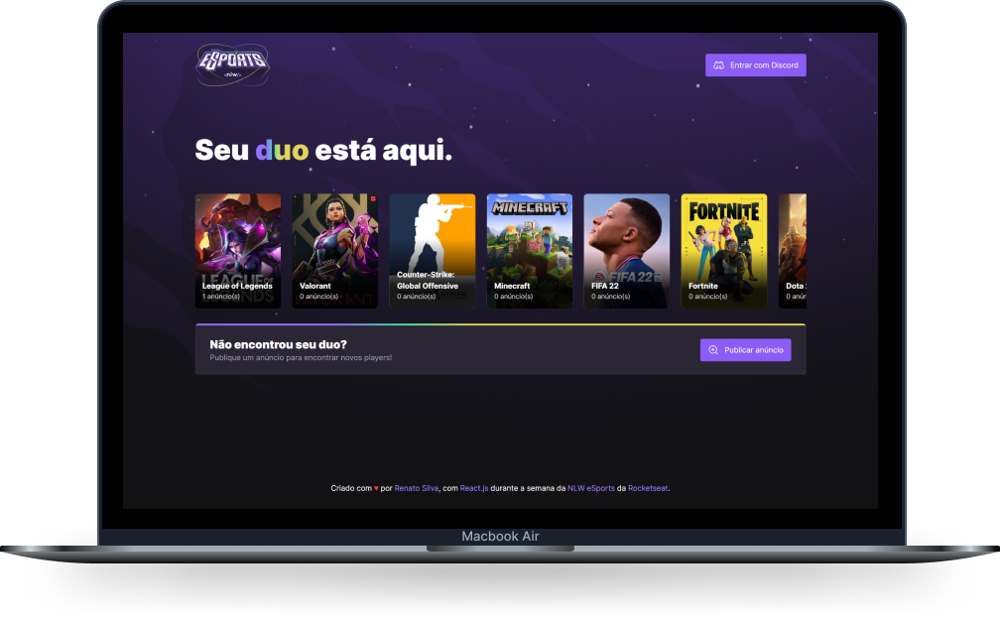

  

 

  

## ✨ Tecnologias

Esse projeto foi desenvolvido com as seguintes tecnologias:

- [React](https://pt-br.reactjs.org/)
- [React Router](https://reactrouter.com/en/main)
- [TypeScript](https://www.typescriptlang.org/)
- [Supabase](https://supabase.com/)
- [Tailwind CSS](https://tailwindcss.com/)
- [Swiper](https://swiperjs.com/)
- [Phosphor React](https://github.com/phosphor-icons/phosphor-react)

## 🚀 Como executar

- Clone o repositório
- Instale as dependências com `yarn`
- Inicie o servidor com `yarn dev`

Agora você pode acessar [`localhost:5173`](http://localhost:5173) do seu navegador.

---

Feito com ♥ por Renato Silva 👋🏻
